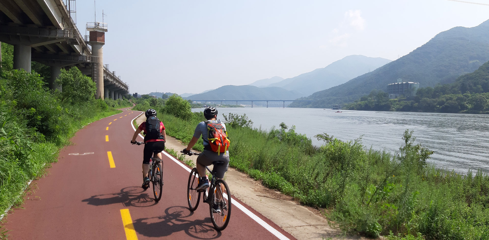

# Portfolio: Analysis of Bike Rental Data in Seoul 🚴

**1. Project Overview** 📽️

This project focuses on the analysis of a public dataset related to bike rental demand in Seoul, South Korea. The goal of this portfolio is to examine factors influencing the number of bikes rented per day and apply various machine learning models to predict and classify demand levels.

The analysis includes:

	•	Correlation analysis to identify the most impactful features
	•	Regression models (Linear and Polynomial) to model the relationship between temperature and bike rentals
	•	Clustering using K-Means to classify demand levels
	•	Application of a neural network for further prediction improvement

**2. Data Source** 💽

The dataset used in this project consists of daily bike rental data, alongside various weather conditions. Features in the dataset include temperature, humidity, wind speed, solar radiation, rainfall, and more.

Key Columns:

	•	Rented Bike Count: The target variable, representing the total number of bikes rented per day.
	•	Temperature (°C): Average daily temperature.
	•	Humidity (%): Average daily humidity.
	•	Wind speed (m/s): Average daily wind speed.
	•	Visibility (10m): Average visibility.
	•	Rainfall (mm): Total daily rainfall.
	•	Seasons, Holiday, Functioning Day: Categorical columns that are relevant to bike rental behavior.

## Models Applied

**1. Correlation Analysis** 📈

The initial stage of the project focuses on identifying the most influential features affecting the Rented Bike Count. A heatmap was generated to visualize the correlations between each feature and the target variable. Key insights include the strong positive correlation of Temperature with the number of bikes rented.

**2. Linear Regression**

Linear regression was used to model the relationship between temperature and the number of bikes rented. The model, while effective in general, yielded an R² score of -0.04, indicating that linear regression was not the best fit for this particular data distribution.

**3. Polynomial Regression** 📉

To capture the curvature observed in the data, polynomial regression models of degrees 1 to 3 were applied. The 1st-degree polynomial performed the best with an R² score of 0.80, significantly improving prediction accuracy. However, increasing the degree led to overfitting and a decline in model performance.

**4. Neural Network** 📊

A simple neural network model with multiple hidden layers was implemented to further improve predictions. This model achieved an R² score of 0.877, showing the best performance among the models tested, suggesting that neural networks are well-suited for complex, nonlinear relationships in the data.

**5. K-Means Clustering** 🏘️

The dataset was clustered into three groups, representing “Low Demand,” “Average Demand,” and “High Demand” days. The K-Means clustering approach allowed for a clear segmentation of the dataset based on demand levels, further aiding in classification and prediction tasks.

## Visualizations 🎨

Several visualizations were generated throughout the project to support the analysis and model interpretation. These include:

	•	Heatmap of feature correlations
	•	Scatter plots with best-fit lines for the regression models
	•	Bar charts comparing R² scores across models
	•	Visualization of demand-level clusters using color-coded scatter plots

Repository Structure

	•	Portfolio 4.ipynb: Jupyter notebook containing the full analysis, including code, outputs, and visualizations.
	•	data/: The folder containing the dataset used for this analysis.
	•	README.md: This file, providing an overview of the project, models applied, and key insights.

## How to Run the Code 🏃

1. Clone this repository to your local machine using the command:
   
		git clone <repository_url>

2. Install the necessary dependencies:

		pip install -r requirements.txt

3. Open the Jupyter notebook in your preferred environment:

		jupyter notebook Portfolio\ 4.ipynb

4. Execute the cells in sequence to reproduce the analysis and visualizations.

## Conclusion 🎬

This portfolio has provided valuable insights into the factors influencing bike rentals in Seoul. Temperature plays a key role, and polynomial regression combined with neural networks demonstrates the best prediction performance. Additionally, K-Means clustering effectively categorizes rental demand into distinct groups, which can be useful for future analysis and decision-making processes.

## Future Work

Further improvements could include handling potential outliers, incorporating additional external datasets for enhanced prediction accuracy, and applying more advanced neural network architectures.

